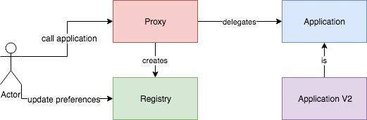

# Upgradable-contracts
There are several upgradable patterns which exist and among the most popular one is the proxy upgrade pattern, this is one of the most fascinating patterns that require deep knowledge of the EVM to make it right. This is my attempt to make the proxy pattern trustless.

## What does trustless mean? 
To me it means that the system behaves all users exactly the same and every user has the right to deny any upgrades they do not wish to be part of, Currently, Ownable pattern is used to upgrade the proxy based contracts which adds trust to the central authority. To eliminate this, I propose the following architecture:

## Architecture
The proxy works just like a normal proxy, it even uses the same lines of assembly code as any other proxy, the difference comes in the way it operates. I add a new contract called the Registry which acts as a never to be upgraded contract and its only present to aid users to control which implementation version they want use. What does this mean? It means that users now have a choice of opting out of upgrades which means different users will be using different versions of the application contract (which is what happens with Google Play). 

The proxy first checks the users preferences in the Registry contract to see if user is using the default version or a specific version. Now, this maybe true that the user has the preferences set to not upgrade but in this case, the user must update the registry with the implementation address they wish to use, otherwise it would default to defaultImplementation address. The idea is that the registry contract must be made public so the users can select the version they wish to use. 

The registry contract is owned by the Proxy contract as it created it, the reason it doesnt add trust in my opinion is because the contract code is well defined and any arbitrary function should not be possible to run
